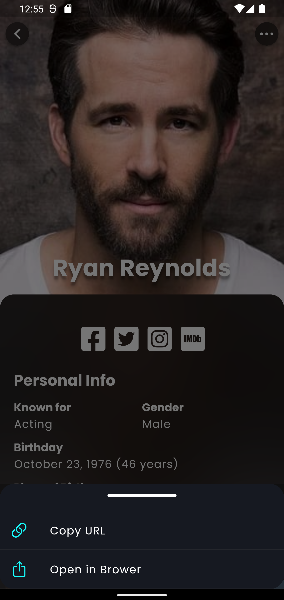

# Squadio Assessment Task

## here are the app's features and functionalities

- Home Screen with an infinite scrollable list of popular people.
- Detailed view of a person's info and their photos and social media links.
- Full screen image viewer with the option to save the image to the gallery.
- Caching home list of data locally to be used when there is no internet.
- Native Splash Screen. (squadio logo)
- Launcher Icons. (squadio logo)

## Some screenshots from the app

